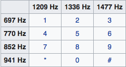
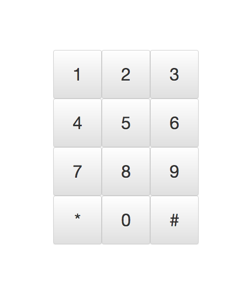

# react-dtmf-dialer

## What is this?
A simple demo showing how to use React and Redux middleware to control a Web Audio API system.

[DTMF](https://en.wikipedia.org/wiki/Dual-tone_multi-frequency_signaling) (Dual-tone multi-frequency) signaling is the
audio protocol used by TouchTone telephones to dial numbers. In short, when a key on the keypad is pressed, two 
frequencies are emitted, according to the following table:



We can simulate a TouchTone keypad using the 
[Web Audio API](https://developer.mozilla.org/en-US/docs/Web/API/Web_Audio_API) 
by wiring up a couple of
oscillators and telling them which frequencies to play when we press a key. The
question is how to interface such an audio system with a React/Redux application.

With React/Redux, reducers generally handle actions that we dispatch from the UI,
e.g., 'play these two tones'. However reducers are meant to manage serializable 
application state. A Web Audio system is not a serializable thing and has no place 
being handled in a reducer. Instead, we handle such things with middleware. 

This demo and [the accompanying video](https://youtu.be/zps9YDPJha0) demonstrate how to achieve that.

## Setup

### Install Node and npm
[Node](https://nodejs.org/en/download/) 10.0 or above (also installs npm)

### Install Node modules
```cd path/to/react-dtmf-dialer``` (the rest of this document assumes you are at this location)

```npm install```

## Launch

The npm script to launch the application has been defined in ```package.json```.

#### Inside your IDE
If you're running a modern IDE like Webstorm, you can just open the npm window and double-click on each ```start``` script. 

#### From the command line

```npm run start```

Once that's done, open a browser window and navigate to ```http://localhost:3000/```

You should see the application keypad:



Click a key to hear that TouchTone goodness.

## Dependencies
This React client uses:
  * [react-scripts](https://www.npmjs.com/package/react-scripts) for abstracting away the config of Babel, Webpack, and JSX
  * [redux](https://github.com/reduxjs/redux) to manage application state
  * [react-redux](https://github.com/reduxjs/react-redux) to inject the store's dispatch function and selected parts of the 
application state into any component's props. 
  * [bootstrap](https://getbootstrap.com/) for UI components
  * [react-bootstrap](https://react-bootstrap.github.io/) for integration of bootstrap with react
  * [styled-components](https://www.styled-components.com/) to apply CSS for managing the layout and making the buttons nice and square
  * [react-app-rewired](https://github.com/timarney/react-app-rewired) for overriding react-scripts so styled-components can do its magic
  
